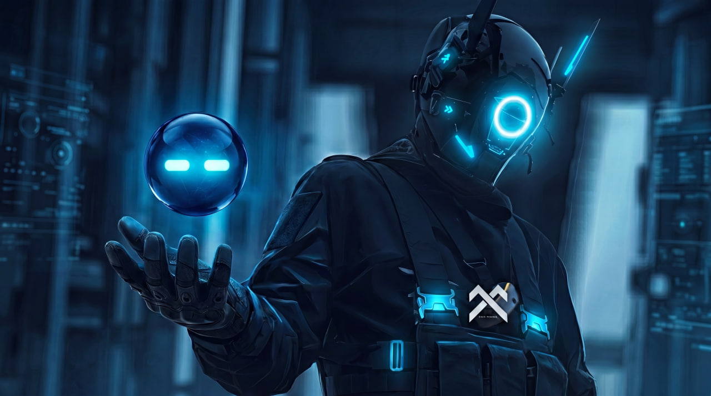

<p align="center">
  
</p>

◢◤ MANTLE AI SWARM ◥◣
/// Autonomous Trading Intelligence


│ 12-crate Rust workspace. 25,365 LOC. Zero external databases.
│ 6 Intelligence Layers. 4-state regime detection. 5-filter pre-trade risk engine.
│ LLM consensus + neural brain + collective intelligence + **live on-chain execution**.
│ Live DexScreener data feeds. ERC-8004 reputation on Mantle Mainnet.
│ Built for the [Mantle Turing Test Hackathon 2026](https://dorahacks.io/hackathon/2130/detail).

◆ [LIVE DASHBOARD](https://mantle-ai-swarm.vercel.app) ╱ [ERC-8004 REGISTRY (verified)](https://mantlescan.xyz/address/0xEb271ece1aB2f72835556Ee67ad0BCA36a378a66#code) ╱ [FLASH LIQUIDATOR (verified)](https://mantlescan.xyz/address/0x19A53120FE1f0147f28fE83c2922A402AC98217c#code)

│ ◆ LIVE NOW (verifiable telemetry):
│   10,000+ autonomous decision cycles · 300+ hours continuous uptime.
│   17,800+ AI verdicts evaluated · 78.9% swarm agreement · only **17 trades executed** — consensus-gated, by design.
│   4,500+ signed transactions on Mantle Mainnet (agent wallet `0xF023…c79`).

◢◤￣￣￣￣￣￣￣￣￣￣￣￣￣￣￣￣￣￣￣￣◥◣

  /// ARCHITECTURE

◥◣＿＿＿＿＿＿＿＿＿＿＿＿＿＿＿＿＿＿＿＿◢◤

```
┌─────────────────────────────────────────────────────────────────┐
│                    SWARM ORCHESTRATOR                           │
│              (swarm-engine — main loop)                         │
├────────────┬────────────┬─────────────┬────────────────────────┤
│            │            │             │                        │
│  OUROBOROS │   TITAN    │  HIVE MIND  │     TURING AGENTS        │
│   BRAIN    │   CORE     │   INTEL     │  (6 autonomous nodes)  │
│            │            │             │                        │
│ LLM Debate │ Neural     │ 40-Module   │ Consensus · Risk       │
│ 15-Factor  │ Brain      │ Memory      │ Sentiment Oracle · Memory    │
│ Judge      │ 8-Gate     │ Castle      │ Sniper · Liquidator    │
│ Memory     │ Entry      │ ML Local    │                        │
│ Breaker    │ Pipeline   │ SIMD 4x     │ PolicyGovernor         │
│            │ Kelly Risk │ Backtester  │ Voting Engine          │
├────────────┴────────────┴─────────────┴────────────────────────┤
│                     MANTLE CHAIN ADAPTER                       │
│        Alloy 2.0 · Chain 5000 · ERC-8004 Identity NFT         │
│        TuringFlashLiquidator · Agni Finance Router               │
├─────────────────────────────────────────────────────────────────┤
│                     CORE IPC (L0)                              │
│          mmap zero-copy · inter-agent state sync               │
└─────────────────────────────────────────────────────────────────┘
```

─── / ───

/// CRATE MAP

| Crate | LOC | Role |
|-------|-----|------|
| **ouroboros-brain** | 3,975 | LLM consensus: multi-model debate, 15-factor judge, decision memory, circuit breaker, pre-trade risk engine (5 institutional filters) |
| **titan-core** | 4,532 | Neural brain: 8-gate entry, trailing SL (ATR+BE+adverse), 3-stage unstuck, RiskMatrix, ConfidenceEngine (DNA scoring), AutoRamp (5-phase capital), Deallow (ban scanner), PatienceTracker (15m lock) |
| **hive-intel** | 12,634 | Collective intelligence: 40+ cognitive modules, SIMD turbo, ML local (<1μs), regime detection (4-state HMM), affective memory (EWMA), hybrid recall (OWM+SIMD+anti-survivorship), paper engine, AI vs Human benchmark |
| **mantle-chain** | 851 | Alloy 2.0 on-chain: ERC-8004 ABI (sol!), wallet signer + live tx broadcast, DexScreener 13-field live data, Merchant Moe/Agni router |
| **swarm-engine** | 1,499 | Main orchestrator — v5.0 24-stage pipeline + telemetry HTTP server (:3402/7 endpoints) + live chain broadcast |
| **turing-consensus** | 397 | PolicyGovernor — 4-voter consensus engine for trade decisions |
| **turing-risk** | 560 | Regime-aware Kelly sizing, KillSwitch, ATR stops, BucketCap risk management |
| **turing-oracle** | 83 | Sentiment Oracle — live prediction market sentiment tracker |
| **turing-memory** | 124 | HyperEdge graph + sled DB persistent memory |
| **turing-sniper** | 524 | DEX execution + autonomous reward protocol client |
| **turing-liquidator** | 111 | On-chain flash liquidation via ILendingPool |
| **core-ipc** | 75 | mmap-based zero-copy inter-agent communication |

◢◤ THE V5 DECISION PIPELINE ◥◣

```
Market Data
    ↓
╔═ REGIME DETECTION (4-state HMM: TrendingUp/Down/Ranging/Volatile) ═╗
    ↓
╔═ OUROBOROS LLM DEBATE (Bull vs Bear, rotating 6-model pool, 7 vendors) ═╗
    ↓
╔═ HIVE MIND ML (7-feature LogReg <1μs + Hybrid Recall + EWMA Affective) ═╗
    ↓
╔═ 15-FACTOR JUDGE (TOML-configurable scoring engine) ═╗
    ↓
╔═ PRE-TRADE RISK (5 institutional filters: drawdown/streak/correlation/cap/confidence) ═╗
    ↓
╔═ TITAN ENTRY (8-gate pipeline: daily loss, symbol streak, imbalance, margin) ═╗
    ↓
╔═ TURING CONSENSUS (PolicyGovernor: signal + trend + macro = 3-voter majority) ═╗
    ↓
╔═ RISK GATE (Regime-aware Kelly × PreTrade factor × Risk Appetite dampening) ═╗
    ↓
╔═ PAPER TRADE (ATR 1.5× stops, 2:1 R:R, circuit breaker) ═╗
    ↓
╔═ TITAN RISK MATRIX (dynamic leverage: ATR volatility + macro penalty) ═╗
    ↓
╔═ TITAN TRAILING SL (ATR trailing + BE-lock + adverse selection guard) ═╗
    ↓
╔═ TITAN UNSTUCK (3-stage recovery: monitor → partial trim → full evacuation) ═╗
    ↓
╔═ TITAN CONFIDENCE (DNA-based scoring + adaptive ATR + directional bias) ═╗
    ↓
╔═ TITAN AUTO-RAMP (5-phase capital scaling: SEED→SPROUT→GROWTH→MATURE→APEX) ═╗
    ↓
╔═ TITAN DEALLOW (underperformer ban/recovery scanner) ═╗
    ↓
╔═ ANOMALY DETECTION (Z-score + IQR on PnL history) ═╗
    ↓
╔═ DECISION JOURNAL (self-learning memory → future prompt injection) ═╗
    ↓
╔═ MANTLE CHAIN (ERC-8004 reputation update + on-chain tx logging) ═╗
    ↓
╔═ IPC BRIDGE (mmap zero-copy → inter-agent state sync) ═╗
```

/// 15-FACTOR JUDGE — Ouroboros

| # | Factor | Source | Weight |
|---|--------|--------|--------|
| 1 | Price Trend (contrarian) | Market data | ±2.0 |
| 2 | Funding Rate | On-chain | ±1.5 |
| 3 | OI Change | Market data | ±0.5 |
| 4 | Volume Surge | Market data | ×1.3 multiplier |
| 5 | LLM Sentiment | Bull/Bear debate | ±0.5 |
| 6 | Alpha Station (squeeze) | Squeeze detector | +1.0 |
| 7 | ML Prediction | Local ML (<1µs) | dir × conf |
| 8 | Macro Bias | LLM macro judge | ±1.0 |
| 9 | MTF 4H Trend | EMA20/50 + RSI | ±1.5 |
| 10–13 | Hyper Reader | Funding · OI · Liquidations · Whale | combined |
| 14 | HiveMind Memory | Pattern recall | ±3.0 |
| 15 | Macro Guard | FOMC/CPI event penalty | −2.0 / −0.5 / 0 |

> Source of truth: `crates/ouroboros-brain/src/judge.rs` (`chief_judge_v2`). Thresholds in `config/thresholds.toml`.

/// MEMORY STACK (5 Layers)

| Layer | Technology | Purpose |
|-------|-----------|--------|
| **L0** | `DashMap` + `Arc` | Real-time state (lock-free, in-memory) |
| **L1** | Hybrid Recall (OWM + SIMD cosine + anti-survivorship) | Episodic trade memory with forced negative inclusion |
| **L2** | Decision Memory (LLM journal) | Self-learning trade journal → prompt injection |
| **L3** | IPC Bridge (mmap) + HyperEdge Graph (sled DB) | Inter-agent state sync + persistent on-chain memory |
| **L4** | Paper Engine (SL/TP/circuit breaker) | Simulation with ATR-based risk |

─── / ───

/// PERFORMANCE

| Feature | Metric |
|---------|--------|
| ML local inference | < 1μs (logistic regression) |
| SIMD cosine similarity | 4x speedup (AVX2) |
| Regime detection | 4-state HMM classifier |
| Memory recall | Hybrid OWM+Vector blend |
| Position sizing | 3-factor damped Kelly (regime × pretrade × appetite) |
| Binary size (release) | LTO fat + strip + panic=abort |

◢◤ ON-CHAIN (Mantle Mainnet) ◥◣

| Contract | Address | Purpose |
| :--- | :--- | :--- |
| ERC-8004 Registry (v2) | `0xEb271ece1aB2f72835556Ee67ad0BCA36a378a66` | Identity NFT — `onlyOwner` reputation, gated by **realized PnL** |
| TuringFlashLiquidator | `0x19A53120FE1f0147f28fE83c2922A402AC98217c` | AI-scored flash liquidation |
| Agent #1 NFT | Token ID 1 | Already minted — sovereign AI identity |
| Deployment Wallet | `0xF023...c79` | Signed tx broadcast via Alloy |
| Registry v1 (dev/test) | `0x1150f09ae885e6E7BcC0cb38feDd200d7f580008` | MVP registry — **299,860** reputation logged across autonomous dev/test cycles |

> **On-chain activity (verifiable):** During development the agent ran fully autonomously and wrote **every decision on-chain** — accumulating **299,860** reputation points and thousands of verifiable verdict-log transactions on the v1 registry (`0x1150…0008`). The v1 registry was a permissionless MVP (anyone could call `addReputation`), so for the production **v2 registry** we hardened it: reputation is now `onlyOwner` and **minted strictly from realized trading PnL** — an honest, tamper-proof on-chain track record, started from zero. The dev/test history demonstrates sustained autonomous operation; v2 demonstrates the production-grade integrity model.

/// LIVE DATA FEEDS

| Source | Data | Update |
|--------|------|--------|
| DexScreener API | MNT/WETH price, 24h change, volume, buy/sell txns, liquidity | Every cycle |
| Mantle RPC | Wallet balance, ERC-20 balances, contract state | On-demand |
| Derived Signals | Buy/sell ratio, volume acceleration, synthetic funding rate | Computed per cycle |

/// TELEMETRY API

Live transparency endpoint on `http://localhost:3402`:

| Endpoint | Response |
|----------|----------|
| `GET /` | Full swarm state (symbols, verdicts, pipeline, chain info) |
| `GET /health` | Version, uptime, cycle count |
| `GET /verdicts` | Latest AI trade verdicts per symbol |
| `GET /regime` | Current market regime + confidence |

◢◤￣￣￣￣￣￣￣￣￣￣￣￣￣￣￣￣￣￣￣￣◥◣

  /// LLM MODELS (Zero Cost)

◥◣＿＿＿＿＿＿＿＿＿＿＿＿＿＿＿＿＿＿＿＿◢◤

| Role | Models | Vendors |
|------|--------|---------|
| Debate Pool (rotating, 6 models) | Gemma-4-31B · Nex-N2-Pro · Qwen3-80B · Laguna-M.1 · Llama-3.3-70B · GPT-OSS-20B | Google · NexAGI · Alibaba · Poolside · Meta · OpenAI |
| Macro Judge (independent) | GPT-OSS-120B | OpenAI |
| Meta Judge (independent) | Nemotron-Ultra-550B | NVIDIA |

**8 models · 7 vendors** — a rotating 6-model debate pool (re-routes on failure) + 2 independent judges, architecturally separated from the pool to avoid weight-bias. All free-tier via OpenRouter — zero inference cost.

─── / ───

/// QUICK START

```bash
# Build the swarm
cargo build --release --workspace --quiet

# Configure
cp .env.example .env
# Set: OPENROUTER_API_KEY, MANTLE_RPC_URL, PRIVATE_KEY

# Run
cargo run --release -p swarm-engine
```

/// PROJECT STRUCTURE

```
mantle-ai-swarm/
├── .cargo/config.toml         // SIMD AVX2 native CPU flags
├── .env                       // API keys (gitignored)
├── Cargo.toml                 // Workspace root (12 members)
├── config/
│   ├── models.toml            // LLM model pool configuration
│   ├── prompts.toml           // Debate + judge prompt templates
│   └── thresholds.toml        // 15-factor scoring calibration
├── contracts/
│   ├── src/                   // ERC8004Registry + TuringFlashLiquidator
│   ├── script/Deploy.s.sol    // Foundry deployment
│   └── test/Turing.t.sol      // 5 contract tests
├── crates/
│   ├── ouroboros-brain/       // LLM consensus engine
│   ├── titan-core/            // Neural trading brain
│   ├── hive-intel/            // Collective intelligence (40 modules)
│   ├── mantle-chain/          // Alloy 2.0 on-chain adapter
│   ├── swarm-engine/          // Main orchestrator
│   ├── turing-consensus/      // PolicyGovernor voting
│   ├── turing-risk/           // Kelly + KillSwitch
│   ├── turing-oracle/         // Prediction market oracle
│   ├── turing-memory/         // HyperEdge persistent memory
│   ├── turing-sniper/         // DEX execution
│   ├── turing-liquidator/     // Flash liquidation
│   └── core-ipc/              // mmap IPC bridge
├── dashboard/                 // React monitoring UI
└── tools/                     // Test utilities
```

◢◤ ORIGIN ◥◣

Converged from three battle-tested trading engines — Ouroboros (LLM brain), Titan (execution), Hive Mind (intelligence) — and unified with Turing on-chain infrastructure for the Mantle Turing Test Hackathon 2026.

25,365 lines of Rust. 12 crates. 6 intelligence layers. 24 pipeline stages. Live Mantle data. Zero compromises.

Built by [Triarchy Labs](https://github.com/Triarchy-Labs).

<p align="center">
  
</p>

<p align="center"><sub>◢◤ MANTLE AI SWARM ◥◣ · triarchy labs · mantle l2 · chain 5000 · erc-8004</sub></p>
